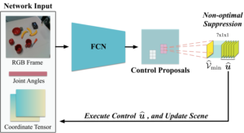
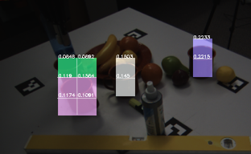
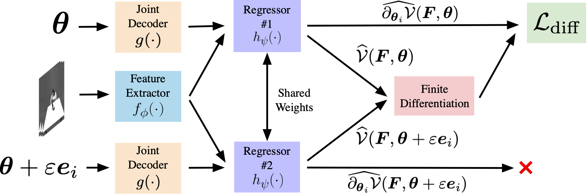

# >> Learning from Classical Control
---
 

**End-to-end Multi-Instance Robotic Reaching from Monocular Vision** [[Paper](https://ieeexplore.ieee.org/abstract/document/9561518)] 
[**Zheyu Zhuang**](https://zheyu-zhuang.github.io), [Xin Yu](https://profiles.uts.edu.au/Xin.Yu), [Robert Mahony](https://cecs.anu.edu.au/people/robert-mahony) 
<em>IEEE International Conference on Robotics and Automation (ICRA)</em>, 2021.

  
Abstract

Multi-instance scenes are especially challenging for end-to-end visuomotor (image-to-control) learning algorithms. “Pipeline” visual servo control algorithms use separate detection, selection and servo stages, allowing algorithms to focus on a single object instance during servo control. End-to-end systems do not have separate detection and selection stages and need to address the visual ambiguities introduced by the presence of an arbitrary number of visually identical or similar objects during servo control. However, end-to-end schemes avoid embedding errors from detection and selection stages in the servo control behaviour, are more dynamically robust to changing scenes and are algorithmically simpler. In this paper, we present a reactive real-time end-to-end visuomotor learning algorithm for multi-instance reaching. The proposed algorithm uses a monocular RGB image and the manipulator’s joint angles as the input to a light-weight fullyconvolutional network (FCN) to generate control candidates. A key innovation of the proposed method is identifying the optimal control candidate by regressing a control-Lyapunov function (cLf) value. The multi-instance capability emerges naturally from the stability analysis associated with the cLf formulation...

---

**LyRN (Lyapunov Reaching Network): A Real-Time Closed Loop approach from Monocular Vision** [[Paper](https://arxiv.org/pdf/2005.12072.pdf)] 
[**Zheyu Zhuang**](https://zheyu-zhuang.github.io), [Xin Yu](https://profiles.uts.edu.au/Xin.Yu), [Robert Mahony](https://cecs.anu.edu.au/people/robert-mahony) 
<em>IEEE International Conference on Robotics and Automation (ICRA)</em>, 2020.

  
Abstract

We propose a closed-loop, multi-instance control algorithm for visually guided reaching based on novel learning principles. A control Lyapunov function methodology is used to design a reaching action for a complex multi-instance task in the case where full state information (poses of all potential reaching points) is available. The proposed algorithm uses monocular vision and manipulator joint angles as the input to a deep convolution neural network to predict the value of the control Lyapunov function (cLf) and corresponding velocity control. The resulting network output is used in real-time as visual control for the grasping task with the multi-instance capability emerging naturally from the design of the control Lyapunov function...

---

 

**Learning real-time closed loop robotic reaching from monocular vision by exploiting a control Lyapunov function structure** [[Paper](https://arxiv.org/pdf/2005.12072.pdf)] 

[**Zheyu Zhuang**](https://zheyu-zhuang.github.io), [Jürgen Leitner](https://juxi.net), [Robert Mahony](https://cecs.anu.edu.au/people/robert-mahony) 
<em>IEEE/RSJ International Conference on Intelligent Robots and Systems (IROS)</em>, 2019.

  
Abstract

Visual reaching and grasping is a fundamental problem in robotics research. This paper proposes a novel approach based on deep learning a control Lyapunov function and its derivatives by encouraging a differential constraint in addition to vanilla regression that directly regresses independent joint control inputs. A key advantage of the proposed approach is that an estimate of the value of the control Lyapunov function is available in real-time that can be used to monitor the system performance and provide a level of assurance concerning progress towards the goal. The results we obtain demonstrate that the proposed approach is more robust and more reliable than vanilla regression.

---
# >> Pick-and-Place Robotic Systems

