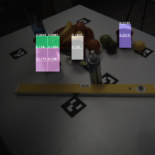

# >> Learning from Classical Control

 

**End-to-end Multi-Instance Robotic Reaching from Monocular Vision** [[Paper](https://ieeexplore.ieee.org/abstract/document/9561518)] 
[**Zheyu Zhuang**](https://zheyu-zhuang.github.io), [Xin Yu](https://profiles.uts.edu.au/Xin.Yu), [Robert Mahony](https://cecs.anu.edu.au/people/robert-mahony) 
<em>IEEE International Conference on Robotics and Automation (ICRA)</em>, 2021. 

---

 

**LyRN (Lyapunov Reaching Network): A Real-Time Closed Loop approach from Monocular Vision** [[Paper](https://arxiv.org/pdf/2005.12072.pdf] 
[**Zheyu Zhuang**](https://zheyu-zhuang.github.io), [Xin Yu](https://profiles.uts.edu.au/Xin.Yu), [Robert Mahony](https://cecs.anu.edu.au/people/robert-mahony) 
<em>IEEE International Conference on Robotics and Automation (ICRA)</em>, 2020. 
