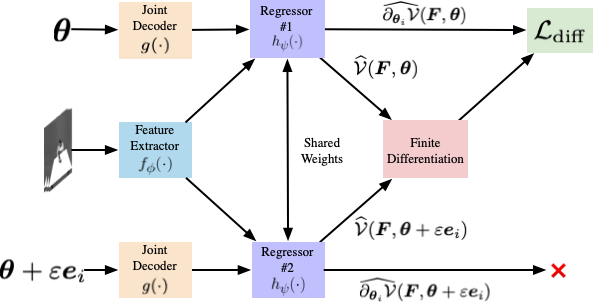

# >> Vision-based Robotic Manipulation
---
 

**End-to-end Multi-Instance Robotic Reaching from Monocular Vision** [[Paper](https://ieeexplore.ieee.org/abstract/document/9561518)] 
[**Zheyu Zhuang**](https://zheyu-zhuang.github.io), [Xin Yu](https://profiles.uts.edu.au/Xin.Yu), [Robert Mahony](https://cecs.anu.edu.au/people/robert-mahony) 
<em>IEEE International Conference on Robotics and Automation (ICRA)</em>, 2021.

  
Abstract

Multi-instance scenes are especially challenging for end-to-end visuomotor (image-to-control) learning algorithms. “Pipeline” visual servo control algorithms use separate detection, selection and servo stages, allowing algorithms to focus on a single object instance during servo control. End-to-end systems do not have separate detection and selection stages and need to address the visual ambiguities introduced by the presence of an arbitrary number of visually identical or similar objects during servo control. However, end-to-end schemes avoid embedding errors from detection and selection stages in the servo control behaviour, are more dynamically robust to changing scenes and are algorithmically simpler. In this paper, we present a reactive real-time end-to-end visuomotor learning algorithm for multi-instance reaching. The proposed algorithm uses a monocular RGB image and the manipulator’s joint angles as the input to a light-weight fully-convolutional network (FCN) to generate control candidates. A key innovation of the proposed method is identifying the optimal control candidate by regressing a control-Lyapunov function (cLf) value. The multi-instance capability emerges naturally from the stability analysis associated with the cLf formulation...

 

---

**LyRN (Lyapunov Reaching Network): A Real-Time Closed Loop Approach from Monocular Vision** [[Paper](https://arxiv.org/pdf/2005.12072.pdf)] 
[**Zheyu Zhuang**](https://zheyu-zhuang.github.io), [Xin Yu](https://profiles.uts.edu.au/Xin.Yu), [Robert Mahony](https://cecs.anu.edu.au/people/robert-mahony) 
<em>IEEE International Conference on Robotics and Automation (ICRA)</em>, 2020.

  
Abstract

We propose a closed-loop, multi-instance control algorithm for visually guided reaching based on novel learning principles. A control Lyapunov function methodology is used to design a reaching action for a complex multi-instance task in the case where full state information (poses of all potential reaching points) is available. The proposed algorithm uses monocular vision and manipulator joint angles as the input to a deep convolution neural network to predict the value of the control Lyapunov function (cLf) and corresponding velocity control. The resulting network output is used in real-time as visual control for the grasping task with the multi-instance capability emerging naturally from the design of the control Lyapunov function...

 

---

 

**Learning Real-time Closed Loop Robotic Reaching from Monocular** [[Paper](https://arxiv.org/pdf/2005.12072.pdf)]
[**Zheyu Zhuang**](https://zheyu-zhuang.github.io), [Jürgen Leitner](https://juxi.net), [Robert Mahony](https://cecs.anu.edu.au/people/robert-mahony) 
<em>IEEE/RSJ International Conference on Intelligent Robots and Systems (IROS)</em>, 2019. 

  
Abstract

 Visual reaching and grasping is a fundamental problem in robotics research. This paper proposes a novel approach based on deep learning a control Lyapunov function and its derivatives by encouraging a differential constraint in addition to vanilla regression that directly regresses independent joint control inputs. A key advantage of the proposed approach is that an estimate of the value of the control Lyapunov function is available in real-time that can be used to monitor the system performance and provide a level of assurance concerning progress towards the goal. The results we obtain demonstrate that the proposed approach is more robust and more reliable than vanilla regression.

 

---

 

**Cartman: The Low-cost Cartesian Manipulator That Won the Amazon Robotics Challenge** [[Paper](https://arxiv.org/abs/1709.06283)][[Code](https://github.com/warehouse-picking-automation-challenges/team_acrv_2017)][[Project Page](http://juxi.net/projects/AmazonRoboticsChallenge/)] 
Doug Morrison, AW Tow, M McTaggart, R Smith, N Kelly-Boxall, S Wade-McCue, J Erskine, R Grinover, A Gurman, T Hunn, D Lee, A Milan, T Pham, G Rallos, A Razjigaev, T Rowntree, K Vijay, [**Z Zhuang**](https://zheyu-zhuang.github.io), C Lehnert, I Reid, P Corke, J Leitner 
<em>International Conference on Robotics and Automation (ICRA), 2018</em>

  
Abstract

The Amazon Robotics Challenge enlisted sixteen teams to each design a pick-and-place robot for autonomous warehousing, addressing development in robotic vision and manipulation. This paper presents the design of our custom- built, cost-effective, Cartesian robot system Cartman, which won first place in the competition finals by stowing 14 (out of 16) and picking all 9 items in 27 minutes, scoring a total of 272 points. We highlight our experience-centred design methodology and key aspects of our system that contributed to our competitiveness. We believe these aspects are crucial to building robust and effective robotic systems.

 

---

 

**Semantic Segmentation from Limited Training Data** [[paper](https://arxiv.org/abs/1709.07665)] 
A. Milan, T. Pham, K. Vijay, D. Morrison, A.W. Tow, L. Liu, J. Erskine, R. Grinover, A. Gurman, T. Hunn, N. Kelly-Boxall, D. Lee, M. McTaggart, G. Rallos, A. Razjigaev, T. Rowntree, T. Shen, R. Smith, S. Wade-McCue, [**Z Zhuang**](https://zheyu-zhuang.github.io), C. Lehnert, G. Lin, I. Reid, P. Corke, J. Leitner 
<em>International Conference on Robotics and Automation (ICRA), 2018 </em>

  
Abstract

We present our approach for robotic perception in cluttered scenes that led to winning the recent Amazon Robotics Challenge (ARC) 2017. Next to small objects with shiny and transparent surfaces, the biggest challenge of the 2017 competition was the introduction of unseen categories. In contrast to traditional approaches which require large collections of annotated data and many hours of training, the task here was to obtain a robust perception pipeline with only few minutes of data acquisition and training time. To that end, we present two strategies that we explored. One is a deep metric learning approach that works in three separate steps: semantic-agnostic boundary detection, patch classification and pixel-wise voting. The other is a fully-supervised semantic segmentation approach with efficient dataset collection. We conduct an extensive analysis of the two methods on our ARC 2017 dataset. Interestingly, only few examples of each class are sufficient to fine-tune even very deep convolutional neural networks for this specific task.

 

---

# >> Object Pose and Depth Estimation

 

**A General Approach to State Refinement** [[Paper](https://ieeexplore.ieee.org/abstract/document/9636400/)] 
 [Gerard Kennedy](http://www.gerard-kennedy.com), Jin Gao, [**Zheyu Zhuang**](https://zheyu-zhuang.github.io), [Xin Yu](https://profiles.uts.edu.au/Xin.Yu), [Robert Mahony](https://cecs.anu.edu.au/people/robert-mahony) 
<em><em>IEEE/RSJ International Conference on Intelligent Robots and Systems (IROS)</em>, 2021. 

  
Abstract

Deep learning algorithms such as Convolutional Neural Networks (CNNs) are currently used to solve a range of robotics and computer vision problems. These networks typically estimate the desired representation in a single forward pass and must therefore learn to converge from a wide range of initial conditions to a precise result. This is challenging, and has led to increased interest in the development of separate refinement modules which learn to improve a given initial estimate, thus reducing the required search space. Such modules are usually developed ad-hoc for each given application, often requiring significant engineering investment. In this work we propose a generic innovation-based CNN. Our CNN is implemented along with a stochastic gradient descent (SGD) algorithm to iteratively refine a given initial estimate. The proposed approach provides a general framework for the development of refinement modules applicable to a wide range of robotics problems. We apply this framework to object pose estimation and depth estimation and demonstrate significant improvement over the initial estimates, in the range of 4.2 8.1%, for both applications.

 

---

 

**Stereo Hybrid Event-Frame (SHEF) Cameras for 3D Perception** [[Paper](https://arxiv.org/pdf/2110.04988.pdf)][[Code](https://github.com/ziweiWWANG/SHEF.git)] 
[Ziwei Wang](https://scholar.google.com/citations?hl=zh-CN&user=hklkyjYAAAAJ), [Liyuan Pan](https://scholar.google.com/citations?user=kAt6-AIAAAAJ&hl=en), [Yonhon Ng](https://scholar.google.com/citations?user=DeHsa3wAAAAJ&hl=en), [**Zheyu Zhuang**](https://zheyu-zhuang.github.io), [Robert Mahony](https://cecs.anu.edu.au/people/robert-mahony) 
<em>IEEE/RSJ International Conference on Intelligent Robots and Systems (IROS)</em>, 2021. 

  
Abstract

Stereo camera systems play an important role in robotics applications to perceive the 3D world. However, conventional cameras have drawbacks such as low dynamic range, motion blur and latency due to the underlying frame- based mechanism. Event cameras address these limitations as they report the brightness changes of each pixel independently with a fine temporal resolution, but they are unable to acquire absolute intensity information directly. Although integrated hybrid event-frame sensors (e.g., DAVIS) are available, the quality of data is compromised by coupling at the pixel level in the circuit fabrication of such cameras. This paper proposes a stereo hybrid event-frame (SHEF) camera system that offers a sensor modality with separate high-quality pure event and pure frame cameras, overcoming the limitations of each separate sensor and allowing for stereo depth estimation. We provide a SHEF dataset targeted at evaluating disparity estimation algorithms and introduce a stereo disparity estimation algorithm that uses edge information extracted from the event stream correlated with the edge detected in the frame data. Our disparity estimation outperforms the state-of-the-art stereo matching algorithm on the SHEF dataset.

 

--- 

 

**6DoF Object Pose Estimation via Differentiable Proxy Voting Regularizer** [[Paper](https://www.bmvc2020-conference.com/assets/papers/0287.pdf)] 
[Xin Yu](https://profiles.uts.edu.au/Xin.Yu), [**Zheyu Zhuang**](https://zheyu-zhuang.github.io), [Piotr Koniusz](http://users.cecs.anu.edu.au/~koniusz/), [Hongdong Li](http://users.cecs.anu.edu.au/~hongdong/) 
<em>The British Machine Vision Conference (BMVC)</em>, 2020.

  
Abstract

Estimating a 6DOF object pose from a single image is very challenging due to occlusions or textureless appearances. Vector-field based keypoint voting has demonstrated its effectiveness and superiority on tackling those issues. However, direct regression of vector-fields neglects that the distances between pixels and keypoints also affect the deviations of hypotheses dramatically. In other words, small errors in direction vectors may generate severely deviated hypotheses when pixels are far away from a keypoint. In this paper, we aim to reduce such errors by incorporating the distances between pixels and keypoints into our objective. To this end, we develop a simple yet effective differentiable proxy voting regularizer (DPVR) which mimics the hypothesis selection in the voting procedure. By exploiting our voting regularizer, we are able to train our network in an end-to-end manner. Experiments on widely used datasets, i.e., LINEMOD and Occlusion LINEMOD, manifest that our DPVR improves pose estimation performance significantly and speeds up the training convergence.

